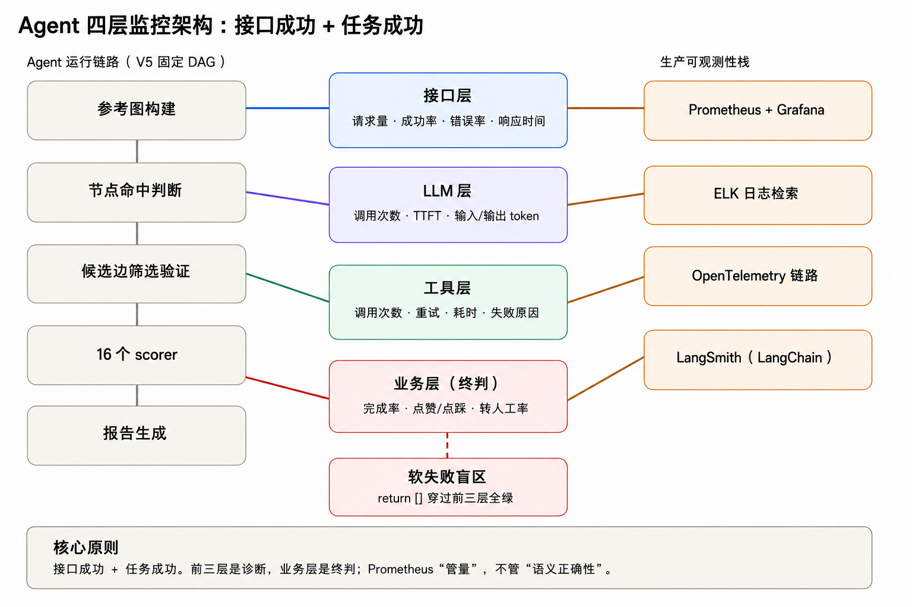

## 1. 代码背景

V5 的圆桌讨论能力评估系统里有一段真实代码。参考语料抽取信息时，如果某批节点为空，直接返回空列表：

```python
def extract_info_concurrent():
    """并发提取信息支持边"""
    if not chance_names or not decision_names:
        return []          # ← 接口照常返回，HTTP 200，但业务结果是个空图
    ...
    for future in as_completed(futures):
        try:
            arcs = future.result()
            all_arcs.extend(arcs)
        except Exception as e:
            logger.error(f"Info batch {i}x{j} failed: {e}")  # ← 异常被记日志后吞掉
```

问题不在代码写错，而在于：调用没抛异常、框架没报错、上游拿到的是一份"看起来正常的空结果"。下一环评分器拿到空关系图，顺理成章地给这位候选人的"协作中心性""影响力"打了 0 分。

这就是 Agent 监控和反常规后端监控最大的区别：**Agent 的失败常常是"软失败"——流程跑完了，结果却是错的或空的。** 所以 Agent 监控必须分层，每一层问不同的问题。

## 2. 四层监控模型



### 1. 接口层：最外层，但最不可信

核心问题：请求通不通、慢不慢

典型指标：请求数量、成功率、错误率、平均响应时间。

在 `pipeline_runner_timed.py` 里用 `timer` 上下文管理器，我给每个阶段记了耗时：

```python
@contextmanager
def timer(timings: Dict[str, float], key: str, logger=None):
    t0 = time.perf_counter()
    try:
        yield
    finally:
        dt = time.perf_counter() - t0
        timings[key] = timings.get(key, 0.0) + dt
        if logger is not None:
            logger.info(f"⏱ {key}: {dt:.3f}s")
```

`ref.extract_nodes`、`disc.node_detection_all_tasks`、`scoring.stage1_parallel_compute` 都被独立计时，最终汇总到 `timings`，相当于接口层的"平均响应时间"按阶段拆分。`pipeline.total` 则是端到端延迟。

**但这层只能回答"流程跑没跑完"，回答不了"跑得对不对"**。

### 2. LLM 层：Agent 的成本与瓶颈都在这

核心问题：模型花了多少、快不快

典型指标：LLM 调用次数、首个 Token 响应时间（TTFT）、总体响应时间、输入和输出 Token 数量。

V5 里 LLM 在三个地方被调用：参考语料节点抽取、讨论节点命中判断、报告摘要。当前 V5 已对**调用耗时**做了分层计时（见上面的 `timer`），并且给 LLM client 加上了统一的 Token / TTFT 埋点——每次调用的 context 消耗、首字延迟都能直接读数，和耗时一起汇入监控面板，LLM 层四个核心指标已经齐了。

为什么 LLM 层指标是必选项：

- **Token 数**决定钱和上下文长度。有了埋点，就能直接看出一次"全量节点交给 LLM 做语义命中判断"到底烧了多少 context，也能定位哪一类调用最贵。
- **TTFT** 反映模型服务是否拥塞。批任务里一次 LLM 卡顿会拖垮整批并行的 fan-out。
- **调用次数**和**任务完成率**结合看，能发现"调用了很多次却没产出"的退化。

#### LLM 埋点实现

**1. 采集器：一次调用 = 一条记录**

`LLMCallRecord` 直接对应 LLM 层的四个核心指标，外加业务语义 `step` 和 `status`：

```python
@dataclass
class LLMCallRecord:
    timestamp: float
    model: str
    step: str                       # 业务步骤标签：ref.node_extract / disc.node_detection / report.summary ...
    status: str = "ok"              # ok | error | empty（HTTP 成功但内容为空，属业务层软失败）
    input_tokens: Optional[int] = None
    output_tokens: Optional[int] = None
    ttft_ms: Optional[float] = None        # 首个 token 响应时间
    total_ms: Optional[float] = None       # 总体响应时间
    error: Optional[str] = None
```

所有上报走 `observe()`，且任何异常都在采集器内部吞掉——监控代码自己绝不能拖垮业务：

```python
def observe(self, *, model, step, status="ok",
            input_tokens=None, output_tokens=None,
            ttft_ms=None, total_ms=None, error=None) -> None:
    try:
        self.record(LLMCallRecord(timestamp=time.time(), model=model,
                                  step=step, status=status, ...))
    except Exception as e:
        logger.debug(f"LLMTelemetry.observe failed (ignored): {e}")
```

**2. 流式封装：TTFT 只能靠 stream 拿到**

TTFT（首个 token 响应时间）没法用 `invoke` 测，必须走 `stream`，抓第一个带 content 的 chunk 到达时刻。`stream_openai_chat` 同时累加流末回传的 `usage` 拿 token 数：

```python
def stream_openai_chat(client, *, model, messages, telemetry, step, ...):
    t0 = time.perf_counter()
    first_token_ts = None
    for chunk in client.chat.completions.create(model=model, messages=messages,
                                                 stream=True,
                                                 stream_options={"include_usage": True}):
        if first_token_ts is None and _chunk_has_content(chunk):
            first_token_ts = time.perf_counter()      # ← TTFT 锚点
        ...
    ttft_ms = (first_token_ts - t0) * 1000 if first_token_ts else None
    total_ms = (time.perf_counter() - t0) * 1000
    if status == "ok" and not content.strip():
        status = "empty"          # HTTP 200 但没内容 → 标成软失败
    telemetry.observe(model=model, step=step, status=status,
                      ttft_ms=ttft_ms, total_ms=total_ms, ...)
```

失败处理上，原样抛出原始异常（`raise exc`），由上层决定要不要静默成空串——保持 V5 既有的 `return []` 行为，但**先记 `error` 再抛**，所以软失败在面板上可见。

**3. 接入点：UnifiedLLMClient.chat 改成流式 + 上报**

LangChain 的 `UnifiedLLMClient` 是参考语料抽取和报告摘要的主力入口。把 `chat` 从 `invoke` 改成 `stream`，每次调用顺手 `observe` 一条：

```python
def chat(self, prompt, step=None, **kwargs):
    telemetry = self.telemetry
    step_label = step or self.default_step
    t0 = time.perf_counter()
    first_token_ts = None
    for chunk in self.llm.stream(prompt):
        if first_token_ts is None and getattr(chunk, "content", None):
            first_token_ts = time.perf_counter()
        parts.append(chunk)
        ...
    telemetry.observe(
        model=self.model_name,
        step=step_label,
        status=status,
        input_tokens=_lc_tokens(usage, "input_tokens"),
        output_tokens=_lc_tokens(usage, "output_tokens"),
        ttft_ms=ttft_ms, total_ms=total_ms, error=err,
    )
    return content
```

### 3. 工具层：Agent 的"手脚"最容易失稳

核心问题：外部能力靠不靠谱

典型指标：调用次数、成功率、重试次数、平均耗时、调用失败原因。

在 V5 项目中，"工具"包括：Embedding 模型（`EmbeddingManager`）、文件读写、邮件通知、外部 API（如节点命中判断用的 DashScope）。这些调用同样会失败，LLM 至多吐一段空回答，工具一旦出错通常是直接抛异常、把整段流程打断。

工具层监控的关键不是"有没有报错"，而是**把失败分类**：网络超时、鉴权失效、解析失败、空结果、部分成功。不分类，你只能看到一个"空结果"，却说不清它来自业务（这人确实没发言）还是技术（API key 过期）——前者该放行，后者该告警，混在一起两头都顾不上。

### 4. 业务层：唯一真正重要的指标

核心问题：任务到底做没做成

典型指标：任务完成率、用户点赞/点踩、转人工率。

这才是 Agent 监控和常规后端监控真正分道扬镳的一层。接口 200、LLM 正常返回、工具全部成功——前三层指标一片绿，**业务结果却可能已经错得离谱**：0 分候选人就是典型，流程跑完了，评估结论却是空的。所以业务层问的问题和前三层都不一样：它不问"服务挂没挂"，而是问"这件事到底做成没有"。

V5 是批处理场景，报告生成即结束，既没有点赞/点踩、也没有转人工率这类常规业务反馈可采集——那些要靠人打分才能有的指标，在这里压根不存在。那业务层靠什么兜底？我们把"任务完成率"定义成一组可自动校验的结构信号：16 个 scorer 是否全部产出、报告文件是否真正落盘、整轮有没有未捕获异常。三者缺一个，就算"进程退出码为 0"也是业务失败。它才是业务层该盯的核心 SLI，而不是那个永远为 0、什么也说明不了的退出码。

## 3. 生产可观测性栈

- **Prometheus + Grafana**：采集并展示四层指标。关键点是**指标要带维度标签**——`agent_step`、`model`、`speaker_id`、`status=success|empty|error`。否则你在 Grafana 上只能看到一条总成功率，定位不到是哪个环节 silently 失败。
- **ELK**：日志查询。Agent 的日志量极大（每批节点、每条边都可能打一行），用 ELK 做全文检索和失败原因聚合，比 `grep` 一个 `timings` 文件强得多。
- **OpenTelemetry**：链路追踪。一次候选人的评估会穿过"参考图构建 → 节点命中 → 候选边筛选 → 16 个 scorer → 报告生成"，OTel 的 trace 能把 LLM 调用、工具调用、内部函数全部串成一条 span 树。
- **LangSmith（链路可视化）**：V5 虽然是自制编排（`PipelineRunner` 固定 DAG）、不是 LangGraph，但所有 LLM 调用都收敛在 `UnifiedLLMClient.chat` 和 `stream_openai_chat` 两处，pipeline 阶段也是有限集合。所以接入 LangSmith 时，我给这两个 LLM 入口和 `run_full_pipeline` 的各阶段套上 `@traceable` 装饰器，把埋点用的 `step` 标签（如 `ref.node_extract`、`disc.node_detection`、`report.summary`）直接作为 LangSmith 的 run name 传进去。这样每次评估在 LangSmith 里就是一条完整 trace：每个 node 的执行、每次 LLM 的输入/输出 token 与耗时、工具调用全部可视化，等于把 LLM 层 + 工具层的"开箱即用"在自制编排上也拿到了。它和自建的 `LLMTelemetry`（Prometheus 指标）互补——LangSmith 管"这一次具体跑成了什么样"（debug/trace），`LLMTelemetry` 管"长期量化 SLI"（Grafana 看板）。

这里有一个容易踩的坑：不能指望 Prometheus 替你发现业务层失败。**Prometheus 擅长"计数和延迟"，不擅长"语义正确性"**。0 分候选人那个事故里，Grafana 上各项全是绿的——接口成功率 100%、LLM 层 token 正常、工具层也没报错。真正出问题的"抽取出的关系图是空的"这件事，从来没被变成任何一个指标：代码里只是 `return []`，既没记节点数、也没打标签。所以唯一的修法，是在抽取环节埋一个 `extracted_node_count` 计数器（或把"关系图为空"记成带 `status="empty"` 标签的一次调用）——这样它变成了一条能画曲线、能拉告警线的时序数据，归零的那一刻面板就会跳红，而不是等候选人真拿了 0 分才被人发现。

## 4. 小结

回到题目本身：如何监控 Agent 运行状态？

我的答案就一句话——**别把"接口返回 200"当成 Agent 活着的证据。** Agent 的失败大多是软失败：流程跑完了，结果却是空的或错的。要看见这种失败，就得在四个层各自问对问题：接口层看量和延迟、LLM 层看 token 和首字延迟、工具层看失败分类、业务层看任务到底有没有真完成。

V5 这个项目有 `timer` 分层计时，却长期没把"抽取出 0 个节点"这类业务空结果变成指标——于是 0 分候选人事故在 Grafana 上全绿。后来我们给 LLM client 加了 Token / TTFT 埋点（`LLMTelemetry`），又用 `extracted_node_count` 把空关系图显式上报，Prometheus 才第一次能画出那条会归零的曲线。监控不是装一套 Prometheus + Grafana 就完了，而是把每一层"看不见的失败"逐一变成看得见的数字。
