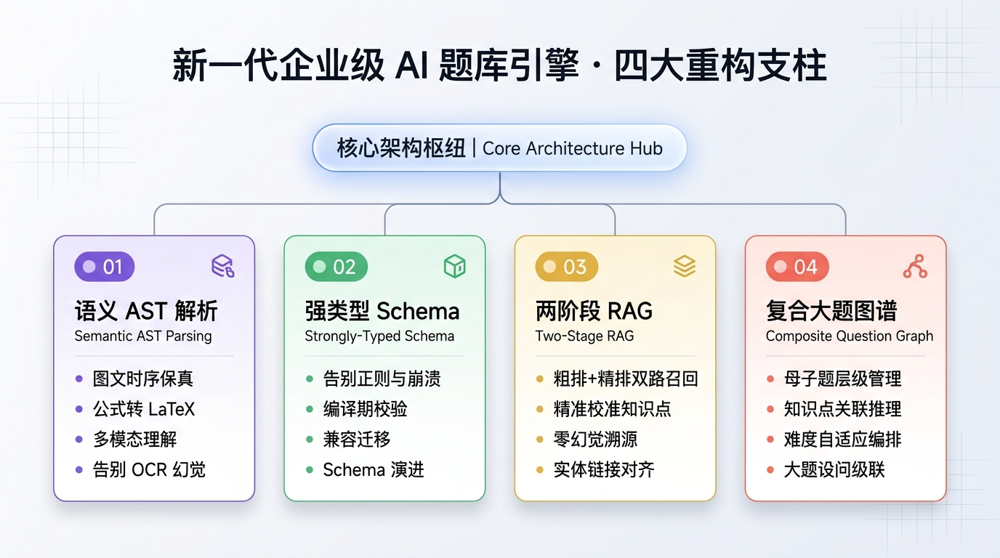

## 背景：2023 年底，当企业考试遇上大模型

2023 年 11 月，大模型浪潮正席卷千行百业。当时我所在的公司是一家专注为企业、政府机关与高校提供在线考试、员工培训与能力测评的 SaaS 服务商。

在企业级考试与培训业务中，客户最大的痛点之一就是<strong>“出题成本高、题库更新慢”</strong>：

* 某大型能源与制造企业，每次发布数百页的《最新安全生产作业规程》，需要教研培训组花两周时间人工提炼几百道安全考试题；
* 某政府机关或金融机构，面对密集更新的法律合规条例文档，需要迅速生成一套覆盖全员的合规考核题库；
* 传统的人工出题方式周期长、成本高，且对教研人员的专业度依赖极重。

为了**与时俱进拥抱大模型技术**，同时**真正解决企业客户“从厚厚一本培训 Word 讲义到结构化题库”的降本增效痛点**，我们在 2023 年 11 月立项并研发了初代“AI 智能出题”功能。

由于当时团队刚接触大模型不久，受限于技术栈认知与早期的直觉思维，我们给出了一个**极其简单粗暴的工程实现**：

```
[客户上传培训 Word/讲义]
         │
         ▼
[按章节与段落读取纯文本]
         │
         ▼
[按 500 或 2000 字符强行截断切片 (Chunking)]
         │
         ▼
[逐个切片套入 Prompt 批量调 API]
         │
         ▼
[正则表达式提取 "题干: (.+?) 选项: (.+?) 答案: (.+?)"]
         │
         ▼
[强行写入 MySQL 题库]
```

在原型演示（Demo）阶段，喂给系统一段简短的企业文化常识，模型确实能吐出几道格式规整的单选题。但在 2023 年底的技术条件下，当这套系统尝试推向真实业务场景，面对复杂的**安全规程、设备操作手册、行业资质考核与政策法规**时，实际效果并不尽如人意。

业务和客户反馈暴露出不少体验瓶颈：“*这道特种设备操作题怎么没有图示？*”、“*公式和参数表格怎么乱码了？*”、“*打出来的考点标签有的叫‘安全注意事项’，有的叫‘施工安全规定’，后台知识库很难做统一的分类统计...*”

复盘下来，这种初代实现暴露出**四个核心设计硬伤**。

---

## 初代架构“四大设计硬伤”

### 硬伤 1：字符硬截断（Boundary Cut-off），案例文档支离破碎

企业考试文档极少是工整的短句。一份典型的《生产安全事故应急预案》或《合规审查案例》，往往是**“长篇事故背景描述 + 多个连续推演条件 + 综合判定设问”**，篇幅动辄 1500~3000 字。

当我们机械地设定“按 500 字或 2000 字符硬性切块”时：

- **背景与设问断裂**：案例前提被切在 Chunk A，而针对该案例的关键提问被切在 Chunk B；
- **模型严重致幻**：Chunk B 缺少核心上下文，大模型面对“根据上述违规事实，该项目主管应承担何种责任？”无从下手，只能凭空捏造虚假的前提事实；
- **题目上下文残缺**：生成出来的题目变成了“断头题”，学员在答题时完全不知道背景指的是哪次事故。

---

### 硬伤 2：公式与参数表格降级为乱码，专业试题直接瘫痪

在很多工业生产、电力运维、建筑工程及金融精算类的企业考试中，文档中充斥着计算公式（如受力核算、负荷计算）以及大量的工艺参数表格。

Word 文档中的数学与工程公式是以 **OMML (Office Math)** 或复杂结构存储的。早期代码直接调用 `XWPFParagraph.getText()` 提取纯文本：

- 复杂的计算公式退化为零散无序的字符，分子分母结构与根号完全颠倒；
- 表格内部的行列对齐结构彻底丢失，变成了混乱的一坨纯文本；
- 喂给大模型的输入本身就是错漏百出的文字，模型产出的计算题答案与解析自然荒谬不堪。

---

### 硬伤 3：图文分离导致图片丢失，技能与实操题全军覆没

企业培训中最强调“实战与场景化”。例如：

* 消防安全培训中的**灭火器压力表读数图、安全出口逃生路线图**；
* 制造业设备维修中的**元器件接线图、机械部件磨损示意图**；
* 施工现场的**隐患排查全景实拍图**。

在早期 Java 代码中，我们盲目使用了类似 `doc.getAllPictures()` 的 API：

```java
// 典型的“两张皮”写法：
List<XWPFPictureData> pictures = doc.getAllPictures(); // 独立提取所有图片
List<XWPFParagraph> paragraphs = doc.getParagraphs();   // 独立提取所有文本
```

这种做法切断了图片在文档流中的所有时序坐标：

1. 图片变成了没有任何上下文的 `image_1.png`, `image_2.png`；
2. 文本中只剩下“*请观察下图，判断该电气柜存在的安全隐患是（ ）*”，而“图”到底在哪里、属于哪道题，程序完全无法知晓；
3. 导致这类极高价值的技能实操题完全无法生成。

---

### 硬伤 4：自由发挥的考点标签，沦为企业知识库孤岛

企业级考核的最核心诉求之一是<strong>“学情分析与精准复训”</strong>。企业在后台往往预置了严格的培训大纲与合规知识树（如：*安全法规 $\rightarrow$ 消防安全 $\rightarrow$ 用火用电管理 $\rightarrow$ 动火作业审批规范*）。

早期直接在 Prompt 里让大模型“自由提取考点”：

- 面对同一类动火作业考题，大模型打出的标签五花八门：有的叫 `动火合规`，有的叫 `生产安全作业要求`，有的叫 `消防条例`；
- 正则表达式无法限制其命名规范与颗粒度；
- 这些自由生成的文本标签**无法映射到企业系统已有的标准知识点主键（ID）**，导致后台无法按章节筛选试题、无法出具员工薄弱项雷达图，题库资产彻底沦为不可维护的死数据。

---

## 重构的驱动力：与时俱进、攻坚痛点与 RAG 实战

面对这些瓶颈，我们深知缝缝补补已经无济于事。要打造一个能够真正支撑企业级、高严肃性考核的现代化 AI 题库引擎，我们必须从底层架构做一次彻底推倒重来。

这次重构的驱动力来自三个维度：

1. **与时俱进（技术代际跨越）**：大模型生态已经从初期的单文本调用，演进出 **Structured Outputs（结构化输出）**、**多模态（Vision）** 与 **Advanced RAG（高级检索增强）** 等成熟范式；
2. **解决业务痛点（交付高质量资产）**：保障 Word 中图文时序 100% 保真、公式表格无损、出题格式确定、并让每道题精准挂载到标准企业知识树上；
3. **技术攻坚与团队成长（在实战中真正学透 RAG）**：不再停留在简单的向量检索 Demo 层面，而是要在工业级场景下，把**文档 AST 流式解析、Query 改写、两阶段检索（Two-Stage: Recall & Rerank）、实体链接（Entity Linking）与批量摊销优化**全链路跑通。



---

## 总结与工程演进思考

回顾初代 AI 智能出题系统的探索历程，我们最大的体会是：**大模型应用在企业级场景落地时，真正的壁垒往往不在于 Prompt 怎么写，而在于上下游极其繁重的工程数据流治理。**

机械切片、纯文本抓取、正则表达式硬匹配，这些在实验室 Demo 阶段行之有效的方法，在面对真实生产环境中复杂的长篇文档、工程图表与严谨考核体系时，都会迅速露出破绽。

把一个充满硬伤的初代原型，重构为一个高可用、高准确率的生产级题库引擎，历时近 3 个月，主要经历了三个关键攻坚阶段：

1. **文档流图文保真（第 1~3 周）**：深入 Word 底层 XML 机制，利用 Pandoc AST 流式遍历在原位注入行内占位符，彻底解决图片脱节与公式乱码难题；
2. **两阶段检索与考点对齐（第 4~7 周）**：从单一向量检索走向 Advanced RAG，构建“概念提取 + 粗排召回 + LLM 批量精排 + 实体链接”闭环，将考点对齐准确率从 52% 提升至 96.5%；
3. **强类型契约与生产交付（第 8~10 周）**：全面引入 JSON Schema 强类型约束，解决多空多解复杂填空与母子题递归图谱，打通人机协同审核流，实现线上稳定灰度。
