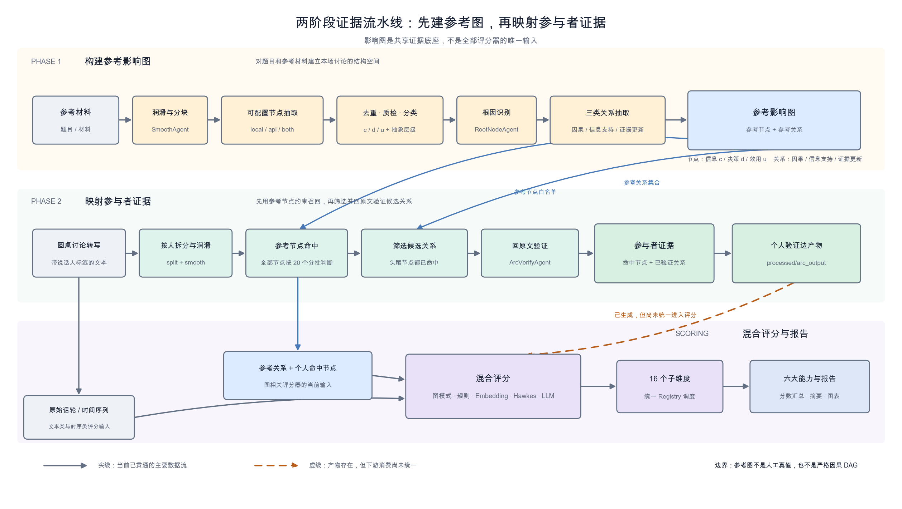

# 一、一个分数最难回答的问题：凭什么

一场无领导小组讨论可能有 5 到 12 个人、持续半小时，转写后是上万字带有抢话、口误和半截句的口语文本。最终需求却很简洁：评价每位参与者的逻辑、目标拆解、信息收集、影响力等能力。

最直接的方案，是把整段转写交给 LLM：

```text
请给每位参与者在 16 个维度上打分，并说明理由。
```

它大概率能返回一份语言流畅的报告。但当面试官追问“为什么这个人逻辑能力更强”，或者模型和 Prompt 更新后分数发生变化时，只剩一段自然语言理由是不够的。系统需要回答三个更具体的问题：

1. 这位参与者到底提到了哪些事实、目标和方案？
2. 他把哪些信息和决策连接在了一起？
3. 评分器使用了什么可复算的中间数据？

V5 的核心选择因此不是“换一个更强的评分模型”，而是先增加一道编译过程：**把参考材料和讨论转写转换成结构化影响图，再让不同评分方法消费这份中间表示。**

这里先说明边界：本文讨论的是当前 V5 的离线批处理实现。影响图是多个评分维度共享的证据底座，但不是 16 个评分器的唯一输入；有些维度直接读取原始话轮、时间序列或再次调用 LLM。

# 二、把表达收敛成有限的节点和关系

原始转写适合人阅读，却不是稳定的计算接口。同一个意思可以有多种说法，一句话也可能同时包含事实、判断和行动建议。

影响图把这些表达转换成有限的节点和关系类型。它很像编译器里的中间表示：上游可以替换转写或抽取模型，下游可以增加新的评分器，双方仍通过相对稳定的结构化协议连接。

当前流水线分为两阶段：

```text
参考材料
  -> 文本润滑与分块
  -> 节点抽取、去重、质检和分类
  -> 三类关系抽取
  -> 参考影响图

圆桌讨论
  -> 按说话人拆分与润滑
  -> 在参考节点集合中判断每个人命中了哪些节点
  -> 从参考图筛选头尾均已命中的候选边
  -> 回到该参与者原文验证关系
  -> 参与者节点集合与经验证的关系

结构化中间产物 + 原始话轮
  -> 图模式、计数、Embedding、Hawkes、规则和 LLM 混合评分
  -> 汇总与报告
```



*图中实线表示当前已经贯通的主要数据流；橙色虚线表示个人验证边已经生成，但尚未被评分模块统一消费。*

这不是让多个 Agent 自由讨论，而是一条由 `PipelineRunner` 固定编排的 workflow。每个 Agent 只负责润滑、抽取、分类或验证中的一个环节，结果则落为 JSON、TSV 或文本文件，供后续阶段读取。

# 三、参考图：先定义本场讨论的结构空间

系统不会先为每位参与者各自自由生成一张图。它先从题目和参考材料中构建一张参考图，给同场讨论建立共同的概念空间。

## 1. 三类节点

节点类型来自影响图的基本语义，但在项目中被用作文本结构化标签：

| 类型 | 代码 | 回答的问题 | 简化示例 |
|---|---|---|---|
| 信息节点 | `c` | 已知或需要判断的事实、条件、现象是什么 | 客户到店量下降 |
| 决策节点 | `d` | 可以采取什么行动 | 调整网点服务时段 |
| 效用节点 | `u` | 希望改善的目标是什么 | 提升网点经营效益 |

节点还会被标记为一级、二级或三级抽象层级。三级节点可以匹配到二级概念；信息节点继续区分已知和未知，效用节点继续区分最终目标和手段目标。这些分类给下游评分器提供了比“出现了多少关键词”更具体的结构。

## 2. 三类关系

| 关系 | 方向 | 含义 |
|---|---|---|
| 因果关系 | 任意节点 -> 任意节点 | 一个状态、判断或行动如何影响另一个节点 |
| 信息支持关系 | 信息节点 -> 决策节点 | 哪条信息为哪个行动提供依据 |
| 证据更新关系 | 已知信息 -> 未知信息 | 新证据如何改变对未知情况的判断 |

每条关系还保存 `condition_probability`，取值语义为“正向或负向”与“确定或不确定”的组合。需要注意的是，当前大部分评分代码读取关系时只保留 `(head, tail)`，这个标签还没有被完整利用。

下面是一个**为解释数据结构而写的简化示例**：

```json
{
  "nodes": [
    {"name": "客户到店量下降", "type": "c"},
    {"name": "调整网点服务时段", "type": "d"},
    {"name": "提升网点经营效益", "type": "u"}
  ],
  "arcs": [
    {
      "head": "客户到店量下降",
      "tail": "调整网点服务时段",
      "condition_probability": "正向且不确定"
    },
    {
      "head": "调整网点服务时段",
      "tail": "提升网点经营效益",
      "condition_probability": "正向且不确定"
    }
  ]
}
```

参考图不是人工真值，也不是严格的因果 DAG。它仍由 LLM 参与抽取和分类，把开放式生成收敛成了一个可以检查、复用和逐步修正的候选结构空间。

# 四、参与者子图：先约束，再回原文验证

参考图构建完成后，讨论阶段不再让模型自由发明节点，而是把参考节点每 20 个分为一批，判断某位参与者是否直接或间接讨论过它们。

命中节点以后，代码只保留头尾都在该参与者节点集合中的参考边，再交给 `ArcVerifyAgent` 回到发言原文逐条验证：

```python
node_names = [node["name"] for node in nodes]

candidate_arcs = [
    arc for arc in all_ref_arcs
    if arc["head"] in node_names and arc["tail"] in node_names
]

if not candidate_arcs:
    return []

verified_arcs = self.verify_agent.verify(text, candidate_arcs)
return [
    arc for arc in verified_arcs
    if arc["head"] in node_names and arc["tail"] in node_names
]
```

这里有两层约束：

1. 节点必须来自参考节点集合；
2. 待验证关系必须来自参考图，而且头尾节点都已被该参与者命中。

这比“请从这段发言中自由抽取所有关系”更容易审计，也缩小了模型可能编造的空间。它具有结构化检索增强的特征，但当前实现不是向量数据库加 Top-K 的标准 RAG：节点命中仍是把全部参考节点分批交给 LLM 判断。

# 五、图进入评分层之后，LLM 不再是唯一裁判

参考图、参与者节点和原始话轮进入评分层后，不同问题由不同工具处理：

| 任务 | 当前使用的主要证据或方法 |
|---|---|
| 逻辑思维、目标拆解、方案影响预判、联想 | 参考图中的关系模式与参与者命中节点 |
| 系统思维、信息收集 | 节点类型、抽象层级和节点数量 |
| 创造性、聚焦性、收敛性 | 节点序列或话轮文本的 Embedding 距离 |
| 思维激发 | 原始讨论时间序列与 Hawkes 点过程 |
| 时间把握、开放度、冲突消解、协作中心性 | 规则、话轮文本、LLM 抽取或图计算 |
| 方案可行性与最终评语 | 结构化节点、原文片段、统计结果与 LLM |

这才是影响图真正的价值：它没有消灭 LLM，而是把 LLM 从“读完全文后直接宣布总分”的角色，拆成了结构抽取、语义判断、关系验证和文字总结等概率组件。能由规则、图算法、Embedding 或统计模型完成的部分，不必全部交给大模型。

同时也要避免一个过于整齐的架构叙述：当前评分器并未统一读取 `processed/arc_output` 中每个人经验证的关系。多个图相关评分器实际上使用“全局参考关系 + 个人命中节点”重建模式。这意味着“关系已经回源验证”和“最终分数只使用经验证关系”目前不是同一件事。

# 六、这套设计带来了什么

## 1. 中间结果可以检查

系统会保存参考节点、三类参考关系、每位参与者的命中节点、候选关系验证结果和评分输入文件。相比只保存最终报告，定位问题时可以继续追问：是转写错误、节点漏召回、关系抽错，还是评分公式本身有问题。

## 2. 参考图可以在同一批任务中复用

参考材料只需要先处理一次，同一场讨论的参与者随后映射到同一个节点和关系空间。这样可以避免为每个人从零抽取一套不可对齐的概念，但它并不自动保证跨题目、跨场次的分数可比。

## 3. 评分逻辑可以独立演进

结构化产物把 Pipeline 和 Scorer 隔开。新增评分维度时，可以优先复用已有节点、关系和话轮数据，而不是再次让 LLM 从整篇转写中重做所有理解。

# 七、当前实现的边界

影响图把问题变得更可计算，但没有自动把系统变成“可信评分器”。当前 V5 至少还有以下限制：

1. **召回存在位置偏差。** 参与者节点判断只读取发言文本前 3000 个字符，后半段提出的概念可能无法命中。
2. **个人验证边尚未贯穿评分链路。** `arc_output` 已经生成，但多个图评分器仍主要依赖参考关系和个人节点共现。
3. **关系强度标签利用不足。** `condition_probability` 在抽取阶段被保存，进入 `DataManager` 后多数场景只剩头尾节点。
4. **并发降低等待时间，却没有解决二次方候选空间。** 因果边抽取会对节点批次做笛卡尔积，节点变多时调用量仍近似按 O(n²) 增长。
5. **可解释不等于有效。** “命中节点更多”或“关系模式更多”只是能力的代理指标，仍需人工标注集、稳定性回归和公平性分析验证。
6. **不能据此声称跨场次可比。** 最终汇总包含组内缩放，不同题目和不同小组之间还缺少固定锚点与校准机制。

因此，当前更准确的成熟度判断是：**文本到影响图、参考节点约束和候选边回源验证已经实现；端到端证据血缘、评分有效性验证仍需要继续补齐。**

# 八、写在最后

直接让 LLM 打分，最省事的地方是没有中间过程；最危险的地方也恰好是没有中间过程。

因此，先把长对话压缩成节点、关系和参与者命中记录，再让图算法、规则、Embedding、统计模型与 LLM 各自处理适合的问题。这层中间表示没让评分变得天然正确，但至少，发现错误的时候，我能指着某个节点、某条边说一句"就是这里"，然后去改。

对招聘评估、内容审核、客服质检、知识抽取这类任务，凡是要让模型替你下判断的场景，这个原则同样适用：**在让模型做判断之前，先设计一份可检查的中间表示；在它给出结论之后，留一条能走回原始证据的路径。**
