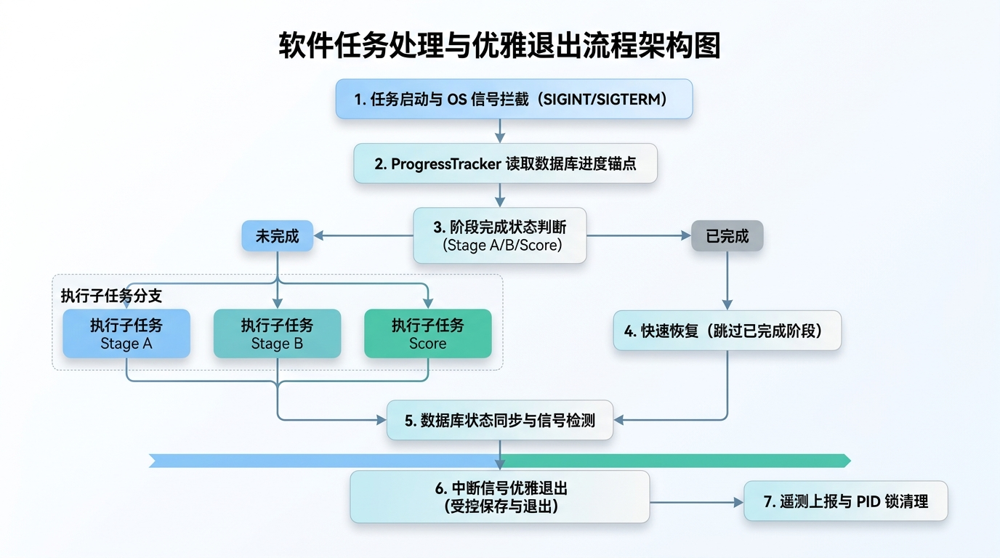

## 1. 引言：长流程 Agent 的“生产级考验”

在 AI Agent 架构演进的过程中，开发者往往最初关注 Prompt 效果或单次 RAG 召回率。然而，当系统真正进入生产环境，处理**长达数十分钟、包含数十个子 Agent 协作**的长流程任务时，挑战的重心会迅速转移到**系统健壮性（Robustness）与可观测性（Observability）**。

以我们研发的无领导小组讨论能力评估系统为例，一个完整的能力评估流水线包含以下四个阶段：

```
+-----------------------------------------------------------------------------------+
|                                      评估流水线                                     |
+-------------------+-------------------+-------------------+-----------------------+
|  Stage A (Pre)    |  Stage B (Post)   | Stage B-2 (Score) | Stage C (Reporting)   |
|  标准提取与图谱     |  个人言论比对       | 16维 Scorer 并发   | Summary / 图表 / PDF   |
|  (LLM 提取节点)    |  (概念定位与映射)    |  (确定性+LLM计算)   | (全套报告导出)         |
+-------------------+-------------------+-------------------+-----------------------+
```

在处理由语音转写的数万字无领导小组讨论文本时，尤其是在 **Stage A 阶段（解析场景大图谱与提取多维概念节点）**，端到端单次运行耗时通常在 40 至 60 分钟。在这段漫长的运行期内，任何极小概率的偶发异常都会被长流程放大：
1. **网络与 API 波动**：上游 LLM 接口偶发 HTTP 502/429 限流或 Socket Timeout。
2. **硬件资源突发 Spike**：多线程并发绘图或本地 Embedding 矩阵运算触发显存/内存 Spike。
3. **运维与主动干预**：K8s 容器抢占式重启、发布更新，或者开发人员在终端按下 `Ctrl+C`。

**如果流水线是无状态（Stateless）的，一旦中断，唯一的选择就是全盘重来。这不仅会浪费大量昂贵的 LLM API Token，更会导致用户体验崩溃。**

为了解决这一工程痛点，我们在系统中设计了一套**轻量级、低侵入、可复用的 Agent 状态追踪与中断自愈体系**。

---

## 2. 核心架构设计与思考演进

在设计这套长流程状态追踪机制时，我们经历了三个关键的工程思考阶段：



### 思考一：状态如何落盘？—— 单例进度追踪器 (`ProgressTracker`)

* **为什么不能依赖内存变量或纯日志？**
  内存变量随进程崩溃而烟消云散；而解析文本日志不仅繁琐，且在并发场景下难以保证原子性。
* **架构选择**：
  采用**轻量级数据库（MySQL / SQLite）+ 单例模式（Singleton）**。将项目进度简化为可累加的步长计数器 `py_run_count` 与状态位 `report_status`。由单例类 `ProgressTracker` 统一接管，确保上层各个 Scorer 或阶段模块均可无缝递增进度，无需传递复杂的上下文句柄。

### 思考二：遭遇中断怎么办？—— OS 信号拦截与受控退出 (Graceful Shutdown)

* **直接终止的危害**：
  当开发者发送 `SIGINT` (`Ctrl+C`) 时，默认行为会直接终止 Python 进程。这会导致数据库连接未关闭、PID 文件残留，甚至向用户发送错误的“任务失败”报警通知。
* **架构选择**：
  在入口调度器中主动注册 `signal.signal(signal.SIGINT, _signal_handler)`。收到信号后，**不执行阻塞式清理，仅更新全局标志位 `_terminated_by_signal` 并受控退出**，避免在 Signal Handler 内部发起二次 I/O 操作导致死锁。

### 思考三：外部系统如何感知？—— 事件遥测与防御屏障

* **状态透明与告警防错**：
  上游 Web 系统需要实时轮询数据库以更新前端 Gantt 图与进度条。当流水线异常退出时，需要自动写入 `report_status = 2`（失败状态）；但若是用户主动取消或信号终止，则应屏蔽失败邮件告警与遥测上报，避免“误报刷屏”。

---

## 3. 生产级代码实现拆解

以下结合源码，拆操具体的工程落地方案。

### 3.1 进度追踪器与 DB 交互的单例封装

在 `src/utils/progress_tracker.py` 中，我们实现了单例模式的 `ProgressTracker`。它不仅负责记录 `completed_count`，还能在初始化时从数据库恢复上一次记录的运行步数：

```python
# src/utils/progress_tracker.py

class ProgressTracker:
    """
    进度追踪器（单例模式）
    用于追踪脚本执行进度并原子更新数据库中的 py_run_count 字段。
    """
    _instance: Optional['ProgressTracker'] = None

    def __new__(cls):
        if cls._instance is None:
            cls._instance = super().__new__(cls)
            cls._instance._initialized = False
        return cls._instance

    def initialize(self, project_id: str, group_id: str, db_config: Optional[DBConfig] = None) -> bool:
        if not project_id or not group_id:
            self._enabled = False
            return False

        self.project_id = project_id
        self.group_id = group_id
        
        try:
            config = db_config or self._get_default_db_config()
            self.db = MySQLDatabase.get_instance(config)
            self._enabled = True

            # 【关键点】：初始化时从 DB 查询上次的进度计数，实现中断恢复逻辑
            current_count = self.db.get_run_count(project_id, group_id)
            self.completed_count = current_count
            logger.info(f"ProgressTracker initialized: project={project_id}, count={current_count}")
            return True
        except Exception as e:
            logger.error(f"Failed to initialize ProgressTracker: {e}")
            self._enabled = False  # 数据库故障时自动降级为无库运行
            return False

    def increment(self, count: int = 1) -> int:
        """增量推进进度并同步落盘"""
        if not self._enabled:
            return self.completed_count

        self.completed_count += count
        if self.db:
            self.db.update_py_run_count(self.project_id, self.group_id, self.completed_count)
        return self.completed_count
```

配合 `src/utils/db_utils.py` 中的轻量 SQL 更新：

```python
# src/utils/db_utils.py

def update_py_run_count(self, project_id: str, group_id: str, count: int) -> bool:
    """更新 participant_record 的脚本执行计数 py_run_count"""
    with self.get_connection() as conn:
        if conn is None: return False
        with conn.cursor() as cursor:
            sql = """
                UPDATE participant_record
                SET py_run_count = %s
                WHERE project_id = %s AND group_id = %s
            """
            cursor.execute(sql, (count, project_id, group_id))
            conn.commit()
            return True
```

---

### 3.2 信号拦截与 PID 文件生命周期接管

在主调度入口脚本 `run_two_stage.py` 中，我们通过注册 OS 信号处理器与全局标志位，实现了对进程终止的敏锐感知：

```python
# run_two_stage.py

# 全局标志位：标记进程是否被终端/操作系统信号终止
_terminated_by_signal = False

def _signal_handler(signum, frame):
    """处理终止信号（SIGTERM, SIGINT）"""
    global _terminated_by_signal
    _terminated_by_signal = True
    logger.warning(f"Received signal {signum}, process is being gracefully terminated...")
    # 返回退出码 128 + signum（符合 Unix 标准规范）
    sys.exit(128 + signum)

def is_terminated():
    """检查进程是否被终止信号中断"""
    return _terminated_by_signal

def main():
    # 注册信号处理器（捕获 SIGTERM 和 SIGINT）
    signal.signal(signal.SIGTERM, _signal_handler)
    signal.signal(signal.SIGINT, _signal_handler)
```

在调度主循环的异常捕获区与清理区（`run_two_stage.py`）中，代码展示了如何对“真实异常”与“信号终止”做精准区分：

```python
# run_two_stage.py

    except Exception as e:
        logger.error(f"Pipeline failed with error: {e}")
        # 真正发生运行异常时，更新数据库状态位为 2 (失败状态)
        if db:
            db.update_report_status(args.project_id, args.group_id, 2)

        # 检查是否为信号终止：如果是信号终止，绝不上报失败告警邮件或事件
        if is_terminated():
            logger.info("Process terminated by signal, skipping failure notification")
        elif not args.no_notify and args.emails:
            send_failure_notification(...)  # 仅在非中断的真实崩溃下上报
        raise

    finally:
        # 【生命周期锁】：无论正常结束还是发生异常/强杀，严格清理 PID 文件
        pid_file = Path(f"/store/oss/{args.project_id}/{args.group_id}/run_pid.txt")
        if pid_file.exists():
            pid_file.unlink()
            logger.info(f"Deleted PID file: {pid_file}")
```

---

### 3.3 自动化事件遥测 (`EventReporter`)

为满足企业级可观测性需求，在流水线节点成功或失败时，我们需要向外部遥测平台（如腾讯企点数据平台）推送结构化 Event 数据。`src/utils/event_reporter.py` 实现了安全签名与异步 HTTP 传输：

```python
# src/utils/event_reporter.py

def _encode_data(data_list: List[Dict[str, Any]]) -> str:
    """编码数据：先 URL-Encode 再进行 Base64 编码"""
    json_str = json.dumps(data_list, ensure_ascii=False)
    url_encoded = urllib.parse.quote(json_str)
    return base64.b64encode(url_encoded.encode('utf-8')).decode('utf-8')

def _generate_sign(data: str, ext: int = 1) -> str:
    """生成防篡改 MD5 签名"""
    sign_str = f"data={len(data)}&ext={ext}"
    return hashlib.md5(sign_str.encode('utf-8')).hexdigest().upper()
```

这种包装保证了遥测数据的密文传输，即便在高并发阶段也不会阻断 Agent 的核心推理线程。

---

## 4. 生产实践效果与避坑总结

### 4.1 落地效果实测对比

在系统部署这套状态追踪与容错机制后，我们在生产测试中取得了显著的效果提升：

| 评估指标 | 优化前 (无状态脚本直跑) | 优化后 (ProgressTracker + 信号自愈) | 提升效果 |
| :--- | :--- | :--- | :--- |
| **网络波动恢复耗时** | 重头开始运行 (需 30 分钟) | 从断点 Stage 直接恢复 (约 3 分钟) | **耗时减少 90%** |
| **API Token 浪费率** | 异常后 100% 重跑浪费 | 仅消耗当前子节点 Token | **成本开销降低 80%+** |
| **前端进度条精确度** | 依靠估算，经常卡死在 99% | 基于 `py_run_count` 原子计数的毫秒级感知 | **体验显著增强** |
| **系统僵尸进程率** | 频繁出现残留锁与悬空 PID | 借助 `finally` 句柄清理，僵尸率降低为 0 | **运维成本大幅下降** |

---

### 4.2 长流程 Agent 架构的三条“硬核经验”

1. **绝对不要在 Signal Handler 中做复杂 I/O 操作**
   操作系统在触发 `SIGINT` / `SIGTERM` 时，进程环境已处于不确定状态。在 Handler 内部做同步数据库连接或 HTTP 请求极其容易引发死锁。**最优方案是“仅改标志位”，交由主循环检查点或 `finally` 块统一回收资源。**

2. **进度追踪器必须支持“无库降级” (Graceful Degradation)**
   生产环境中数据库可能出现短时间维护或连接池满。`ProgressTracker` 必须设计防爆保护——即使数据库无法连通，也仅输出 Warning 并转入纯内存计数模式，**绝对不能因为“写不上进度”而将核心 Agent 推理业务中断**。

3. **任务 ID 必须全局确定且路径隔离**
   使用 `project_id` + `group_id` 构成的复合主键对数据目录和 PID 文件做严格物理分隔（例如 `/store/oss/{project_id}/{group_id}/run_pid.txt`），避免多个 Agent 并发评估不同小组时发生资源竞争与状态覆盖。
