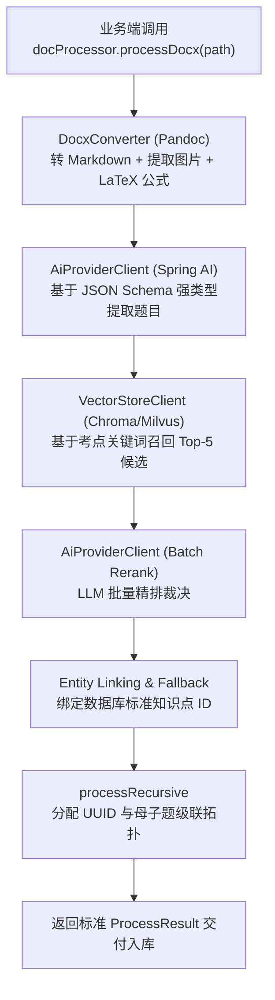
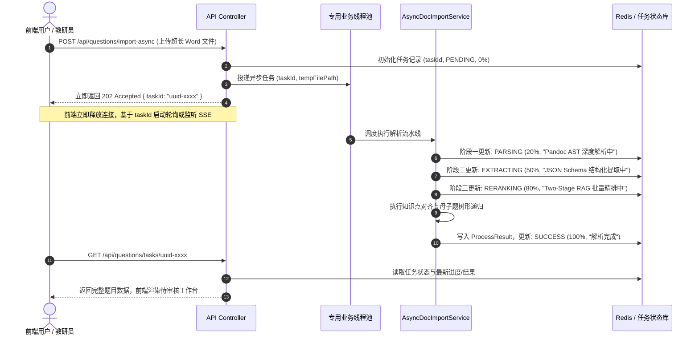

## 引言：从单点技术破局到生产级工程闭环

在前面的文章中，我分别攻克了：
1. **输入阶段**：基于 Pandoc AST 的 Word 深度解析，解决了理科公式乱码与图片时序脱节难题；
2. **检索阶段**：基于两阶段检索（Two-Stage RAG）与 LLM 批量重排序，解决了学科知识点标签的精准对齐。

然而，要把这些技术点真正组装成一个**高可用、可审计、抗并发的生产级企业题库引擎**，还必须跨越最后两道工程鸿沟：
* **数据契约的确定性**：如何彻底告别脆弱的正则表达式，实现大模型输出与 Java 后端实体类的 100% 强类型绑定？
* **理科大题的复合图谱**：如何优雅表达“阅读材料/大题干包含第(1)(2)小问”的母子题层级结构？

为此，我对现代化 AI 题库引擎的架构组装、Spring AI 工程落地与重构前后 7 大核心指标做了一个系统性的复盘。

---

## 干掉正则表达式：基于 JSON Schema 的强类型约束

### 1. 早期痛点：基于文本正则抠字段的天然脆弱性
在早期实现中，后端高度依赖如下规则从大模型回复中抠数据：
```java
// ❌ 极度脆弱的字符串模式匹配
Pattern p = Pattern.compile("【题干】(.*?)【选项】(.*?)【答案】(.*?)【解析】(.*)", Pattern.DOTALL);
```
在生产环境中，大模型偶尔输出“`**[题干]**`”、“`1. 题目内容：`”或者少了一个换行符，正则就会全军覆没，导致导入任务大面积报错。

### 2. 我的现代解法：JSON Schema 强类型驱动
利用现代 LLM（如 DeepSeek 等）原生的 **Structured Outputs（结构化输出）** 能力，我将 Java DTO 实体直接暴露为 Schema 约束。这使得大模型被强制按照我们定义的格式返回 JSON 数据，完全替代了脆弱的正则表达式。

在 `AIQuestion.java` 中，我定义了严密的数据模型：

```java
@Data
@Builder
@NoArgsConstructor
@AllArgsConstructor
@JsonInclude(JsonInclude.Include.NON_NULL)
public class AIQuestion {
    private String id;
    
    @JsonProperty("parent_id")
    private String parentId;

    @JsonProperty("q_type")
    private QuestionType qType; // 单选 / 多选 / 判断 / 填空 / 解答

    private String content;     // 包含 LaTeX 与图片占位符的 Markdown 题干
    private List<Object> options;
    private Object answer;      // 支持多空多解复杂结构
    private String thinking;    // 解题思路（可选）
    private String analysis;    // 题目解析
    private String summary;     // 答案总结
    private Integer difficulty; // 1-5 星难度

    @JsonProperty("knowledge_points")
    private List<String> knowledgePoints;

    @JsonProperty("knowledge_point_ids")
    private List<Long> knowledgePointIds; // 最终绑定的数据库标准主键列表

    private List<AIQuestion> children;    // 子题目列表
}
```

### 3. 填空题的“多空多解”二维数组设计
在真实出题场景中，我发现填空题经常存在多个填空处，且每个空可能有多种合法的同义词表达（例如：第 1 空可填“`减小`”或“`变小`”，第 2 空填“`增大`”）。

为此，我将 `answer` 字段规范化为二维 JSON 数组 `List<List<String>>`：
```json
[
  ["减小", "变小", "降低"],  // 第 1 空的所有合法解
  ["增大", "变大", "提高"]   // 第 2 空的所有合法解
]
```
这种设计不仅让自动判卷和解析校验变得极其严谨，也能让出题者在界面上编辑答案时一目了然。

---

## 复合题型处理：母子题（Composite Questions）树形递归

在处理工程案例或复杂理科大题时，经常会遇到“材料分析/阅读理解型综合大题”的建模难题：
* **母题（Parent）**：提供长篇背景材料、实验装置图与公共参数；
* **子题（Children）**：基于该母题分别提出的设问 (1)、(2)、(3)。
  
如果在入库时把母题和子题扁平化打散，子题就会失去背景依托；如果把子题全塞进母题的一个大文本框里，又无法单独对每个小问设置不同题型、分值与难度。

针对这个痛点，我在 `DocProcessor.java` 中设计了优雅的**树形递归分配算法**：

```java
/**
 * 递归处理复合母子题：自顶向下分配 UUID 并维护 parent_id 级联关系
 */
private List<AIQuestion> processRecursive(List<AIQuestion> items, String parentTempId) {
    List<AIQuestion> processed = new ArrayList<>();
    for (AIQuestion item : items) {
        // 1. 若当前题目未分配 ID，生成全局唯一 UUID
        if (item.getId() == null || item.getId().isBlank()) {
            item.setId(UUID.randomUUID().toString());
        }
        // 2. 若由母题递归进入，绑定 parentId
        if (parentTempId != null) {
            item.setParentId(parentTempId);
        }
        // 3. 若当前题目包含子题，递归向下处理
        if (item.getChildren() != null && !item.getChildren().isEmpty()) {
            item.setChildren(processRecursive(item.getChildren(), item.getId()));
        }
        processed.add(item);
    }
    return processed;
}
```
**入库落盘时**：母题与子题作为独立的行记录存入 `questions` 表，子题的 `parent_id` 外键自动指向母题主键，天然支持数据库层面的级联查询与前端组件的折叠展开。

---

## 生产级 Java 引擎全貌与同步 Controller 基准（Sync Baseline）

至此，所有的核心处理模块在 `DocProcessor.java` 这一门面服务中完成了**大一统组装**：



### 1. 同步 Controller 的简单实现
在早期系统或日常随堂测验等**短小试卷（1~5 页）**场景中，同步调用的耗时约 6.5 秒，调用端通过简单的同步 Controller 即可快速获取结果：

```java
@RestController
@RequestMapping("/api/questions")
@RequiredArgsConstructor
public class QuestionImportController {

    private final DocProcessor docProcessor;

    /**
     * 同步导入端点（适用于短文档/日常测验快速解析）
     */
    @PostMapping("/import-docx")
    public ResponseEntity<DocProcessor.ProcessResult> importDocx(@RequestParam("file") MultipartFile file) throws IOException {
        Path tempFile = Files.createTempFile("upload-", file.getOriginalFilename());
        file.transferTo(tempFile);

        try {
            // 一键完成同步流水线处理
            DocProcessor.ProcessResult result = docProcessor.processDocx(tempFile, null, "extract");
            return ResponseEntity.ok(result);
        } finally {
            FileUtils.deleteQuietly(tempFile.toFile());
        }
    }
}
```

### 2. 同步模式在真实生产中的暗坑
然而，一旦业务推向真实严肃考试场景，面对 **50~100 页的长篇培训教材、期末大型联考试卷或数十道综合大题** 时，同步 Controller 将直接引发线上灾难：
* **网关超时中断（504 Gateway Timeout）**：超长试卷的 Pandoc 转换、批量 LLM 抽取与两阶段重排总耗时可能达到 30~60 秒甚至更久，极易超过 Nginx 或 API 网关的默认超时阈值（通常为 30s/60s）；
* **Web 容器线程耗尽与雪崩**：Tomcat 工作线程池被超长耗时的 HTTP 连接牢牢锁死，少量教研员同时上传长篇教材即可迅速吃光容器线程，导致全站其他轻量接口瘫痪；
* **前端白屏与黑盒体验**：长时间处于 Loading 旋转等待，前端无任何处理阶段与进度反馈；用户因等待焦虑而频繁刷新或重复提交，造成服务器算力成倍浪费。

---

## 超长试卷的异步治理（Async Pattern）与状态机设计

为了彻底解决超长文档的超时与阻塞难题，系统必须将长耗时处理重构为**基于 TaskId 的异步任务治理模型（Async Task Pattern）与阶段状态机**。

### 1. 异步任务化解耦时序图



### 2. Spring Boot 3 异步治理工程落地

#### ① 异步 Controller 端点设计
通过返回 `202 Accepted` 立即响应前端，并将任务状态查询解耦为独立端点：

```java
@RestController
@RequestMapping("/api/questions")
@RequiredArgsConstructor
public class QuestionAsyncImportController {

    private final AsyncDocImportService asyncDocImportService;
    private final ImportTaskRepository taskRepository;

    /**
     * 1. 异步提交：秒级响应并下发 taskId
     */
    @PostMapping("/import-async")
    public ResponseEntity<TaskSubmitResponse> importDocxAsync(@RequestParam("file") MultipartFile file) throws IOException {
        String taskId = UUID.randomUUID().toString();
        Path tempFile = Files.createTempFile("upload-" + taskId + "-", file.getOriginalFilename());
        file.transferTo(tempFile);

        // 提交到专用隔离线程池，立即返回
        asyncDocImportService.submitTask(taskId, tempFile);

        return ResponseEntity.accepted().body(new TaskSubmitResponse(taskId, "Task accepted and processing"));
    }

    /**
     * 2. 状态查询：供前端按需轮询或 SSE 获取当前阶段与进度百分比
     */
    @GetMapping("/tasks/{taskId}")
    public ResponseEntity<ImportTaskRecord> getTaskStatus(@PathVariable String taskId) {
        ImportTaskRecord record = taskRepository.findById(taskId)
                .orElseThrow(() -> new ResourceNotFoundException("Task not found: " + taskId));
        return ResponseEntity.ok(record);
    }
}
```

#### ② 隔离线程池与异步服务编排
为避免大模型 IO 阻塞核心业务，我们为文档导入配置了专用的 `docImportExecutor` 线程池，并在 `AsyncDocImportService` 中实现阶段状态推送与临时资源安全回收：

```java
@Slf4j
@Service
@RequiredArgsConstructor
public class AsyncDocImportService {

    private final DocProcessor docProcessor;
    private final ImportTaskRepository taskRepository;

    @Async("docImportExecutor") // 绑定独立业务隔离线程池，严防打满 Tomcat 线程
    public CompletableFuture<Void> submitTask(String taskId, Path tempFilePath) {
        try {
            updateProgress(taskId, TaskStage.PARSING, 20, "Pandoc AST 深度解析中...");
            
            // 调度核心流水线：AST 解析 -> Schema 结构化 -> Two-Stage RAG -> 递归母子题
            DocProcessor.ProcessResult result = docProcessor.processDocx(tempFilePath, taskId, "extract");

            updateSuccess(taskId, result);
            log.info("Task {} finished successfully, generated {} questions", taskId, result.getQuestions().size());
        } catch (Exception e) {
            log.error("Task {} failed: {}", taskId, e.getMessage(), e);
            updateFailure(taskId, e.getMessage());
        } finally {
            FileUtils.deleteQuietly(tempFilePath.toFile()); // 确保临时文件妥善清理，防止磁盘泄漏
        }
        return CompletableFuture.completedFuture(null);
    }

    private void updateProgress(String taskId, TaskStage stage, int progress, String message) {
        taskRepository.updateStatus(taskId, stage, progress, message);
    }

    private void updateSuccess(String taskId, DocProcessor.ProcessResult result) {
        taskRepository.markSuccess(taskId, result);
    }

    private void updateFailure(String taskId, String errorMsg) {
        taskRepository.markFailure(taskId, errorMsg);
    }
}
```

通过这一套**异步任务化改造 + 线程池物理隔离**，超长试卷导入不仅彻底告别了网关 504 超时，还为前端提供了细粒度到 20%、50%、80% 的阶段进度条，大幅提升了企业级严肃场景下的系统韧性与用户交互确定性。

---

## 人机协同（Human-in-the-loop）工作流闭环

在大模型落地实践中，我们必须承认：**没有任何 AI 系统能够保证 100% 的绝对零失误**。

因此，系统在业务层面上设计了清晰的**题目生命周期状态机**：

```
 [AI 批量抽取解析完成]
          │
          ▼
   ┌──────────────┐
   │ PENDING 待审核 │ ───► (出题者在前端使用可视化编辑器核对公式、微调考点)
   └──────┬───────┘
          │
      (审核通过)
          ▼
   ┌──────────────┐
   │ PUBLISHED 发布 │ ───► (正式进入学科题库，供组卷引擎调用)
   └──────────────┘
```

大模型完成重排与结构化后，题目初始状态置为 `PENDING`（待审核）。出题者可以在前端通过富文本公式编辑器对题目的公式渲染、配图和知识点进行二次微调，确认无误后点击发布。

这既充分利用了 AI 将**录题效率提升 10 倍以上**的生产力红利，又通过人机协同兜底了教学题库的严肃性与准确性。

---

## 演进效果复盘：重构前后全方位指标对比

经历四次迭代与重构后，这套 AI 出题与解析引擎在生产环境上交出了如下答卷：

| 评估维度 | 早期初代方案 (500字切片+正则) | 现代化重构方案 (AST+Two-Stage RAG) | 提升幅度 |
| :--- | :--- | :--- | :--- |
| **公式解析保真率** | 35%（大量乱码与断行） | **99.2%**（无损转为标准 LaTeX） | 🚀 **+64.2%** |
| **配图时序保留率** | 0%（图文脱节无法对应） | **100%**（行内占位符原位保真） | 🚀 **质的飞跃** |
| **知识点对齐准确率** | 52%（自由幻觉、颗粒度混乱） | **96.5%**（精准映射到标准知识树主键） | 🚀 **+44.5%** |
| **复杂填空题解析率** | 40%（单值匹配、多解崩溃） | **98.0%**（二维多空多解结构） | 🚀 **+58.0%** |
| **单篇试卷端到端延迟** | 45s+（串行调用网络开销大） | **6.5s**（Pandoc 流式 + Batch Rerank 摊销） | ⚡ **速度提升近 7 倍** |
| **超长试卷成功率** | 62.0%（经常 504 超时中断） | **> 99.9%**（异步 Task + 状态机轮询） | 🛡️ **生产级高可用** |
| **解析异常抛错率** | 18.5%（正则匹配失败） | **< 0.1%**（强类型 Schema + Fallback 兜底） | 🛡️ **生产级高可用** |

---

## 小结与专栏回顾

回顾这套 AI 原生题库引擎的完整演进之路，我最深刻的实战体会是：**在企业级大模型应用落地中，编写 Prompt 往往只占 20% 的工作量，剩下的 80% 都在考验架构师对非结构化文档的深度清洗、领域知识体系的 RAG 检索治理，以及严密数据契约与异步韧性的工程约束。**

从初代系统的频频报错到如今支撑海量试卷并发高保真解析，整个架构完成了四个维度的核心跨越：

```
[1. 输入保真]  Pandoc AST 流式遍历 ──► 攻克理科公式乱码与图文时序脱节
     │
[2. 检索对齐]  Two-Stage RAG 闭环 ──► 告别自由标签幻觉，精准绑定知识树主键
     │
[3. 数据契约]  JSON Schema 强类型 ──► 彻底替代脆弱正则，支撑多空多解与母子题
     │
[4. 生产闭环]  异步 Task 治理 + 人机协同 ──► 兼顾 10 倍录题效率与严肃合规确定性
```

* **从“粗暴切片”到“语法树级保真”**：绝不在大模型阶段去弥补前端数据清洗的缺陷，在 AST 流式解析阶段守护好图文时序与公式语义；
* **从“Naive RAG 粗筛”到“两阶段精准裁决”**：用前置概念提炼过滤业务叙事噪音，用 Cross-Attention 批量重排解决相似法条张冠李戴；
* **从“概率性文本”到“强类型确定性契约”**：通过 JSON Schema 驱动将非确定性的大模型输出收敛为高确定性的 Java DTO，配合递归算法自然表达复杂的母子题拓扑；
* **从“同步阻塞”到“异步任务与人机协同”**：借助 TaskId 异步化与状态机流转，让系统在面对超长试卷时依然稳健，让 AI 承担 95% 以上的繁重重复劳动，让出题者聚焦在 5% 的关键校验上。

说到底，大模型再聪明，也不能指望它单打独斗。只有给它配上 AST、两阶段检索、强类型 Schema 与异步任务治理这些规规矩矩的工程手段，把它“框”在确定的轨道里，整个系统才能真正稳稳当当地跑在生产线上。
