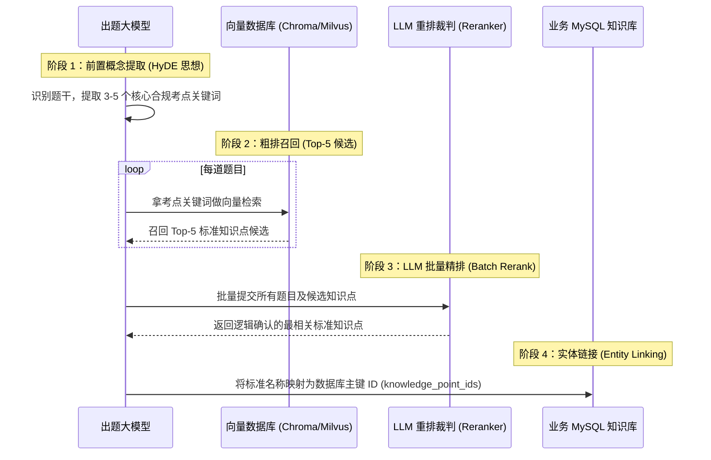

## 为什么“知识点对齐”对企业级考试系统如此重要？

在前两篇文章中，我解决了数据源头的文档解析、公式转换与图文保真问题。但这只是第一步：**把题目读进来**。

企业在线考试与培训系统真正的商业壁垒与核心价值，在于**“结构化知识资产沉淀与精准学情复训”**。

在成熟的企业培训体系中，考点是按照严格的树形大纲组织的：
* 生产安全与合规考核
  * 第二章 特种作业与作业许可
    * 2.3 动火作业安全规范
      * **2.3.1 一级动火作业审批流程 (ID: 3042)**
      * **2.3.2 动火现场可燃气体检测标准 (ID: 3043)**

如果一道考查“动火前气体分析合格标准”的题目入库后，被大模型随意打上 `动火要求`、`气体检测`、`安全生产第2章考点` 等自由文本标签：
1. **题库筛选与智能组卷瘫痪**：教研员按知识大纲抽题组卷时，搜不到这道题；
2. **员工画像失真**：员工在某次考核中做错这道题后，系统无法准确定位其在 `ID: 3043` 上的技能薄弱点，无法实施定向补训；
3. **合规审计风险**：政府监管或外部合规审计时，企业无法拿出“各关键法规条款考核全覆盖”的量化溯源报表。

因此，核心技术目标非常明确：**大模型抽取出来的任何一道题目，必须精准归入企业系统已有的标准知识库主键（`knowledge_point_ids`）。**

---

## 朴素 RAG（Naive RAG）为什么在此场景频频翻车？

最开始，我也尝试过最直觉的 Naive RAG 方案：
1. 将企业培训大纲中的几千个标准知识点名称，通过 Embedding 模型转为向量存入向量库（如 ChromaDB / Milvus / Pgvector）；
2. 提取出一道题后，直接用题干文本去向量库里搜 Top-1，将距离最近的知识点作为答案。

实际跑测试集时，这种 **Naive RAG 方案的准确率只有可怜的 50%~60%**。深入复盘了大量 Badcase，我发现 Naive RAG 在专业合规场景的两大缺点：

### 缺点 1：题干长文本中的背景叙事噪音
企业试题（尤其是案例分析题）充斥着大量背景描述（如“*2024年3月，某化工厂动力车间检修班组在进行管道带压作业时...*”）。如果直接把整道题的文本做 Embedding，向量空间表征会被大量的企业名称、工艺背景词拉偏，反而冲淡了真正的法规考点内核。

### 缺点 2：Bi-Encoder 独立编码的语义局限
向量检索底层基于双塔模型（Bi-Encoder），它分别将 Query 和 Document 压缩为独立的低维稠密向量。
对于考点极其细分的合规条例（如“**一级动火作业审批**”与“**特级动火作业审批**”、“**有限空间作业通风要求**”与“**有限空间作业监护要求**”），它们的向量余弦距离非常接近，单纯依据距离阈值选出的 Top-1 极易出现“概念张冠李戴”。

---

## 破局：我的两阶段检索（Two-Stage RAG）闭环设计

为了达到 95% 以上的生产级准确率，我重新设计了检索架构，引入了 **Advanced RAG 体系中的“两阶段检索与批量重排闭环”**：



---

### 阶段 1：前置概念提取（Query Transformation / HyDE 衍生思想）
我在让大模型提取题目时，要求它在 JSON 中先行输出一个 `knowledge_points` 数组，提炼 3~5 个该题的核心专业术语（例如 `["动火作业审批权限", "作业许可管理规定"]`）。

在进行向量检索时，我**不使用充满噪声的题干全文，而是优先使用大模型初筛出来的提炼词汇作为向量 Query**：

```java
// DocProcessor.java:147-149
String queryText = (q.getKnowledgePoints() != null && !q.getKnowledgePoints().isEmpty())
        ? String.join(" ", q.getKnowledgePoints())
        : q.getContent();
```
这类似于学术界 **HyDE（Hypothetical Document Embeddings）** 的思路：先让大模型生成“假想的标准特征词”，再以此去向量库匹配，瞬间过滤掉 90% 的企业背景故事噪音！

---

### 阶段 2：向量库粗排召回（Recall Top-5）
拿着干净的概念词去向量数据库检索，设置 `limit=5`。
在粗排阶段，我的核心策略是**只保高召回率（Recall），不做最终裁决**，确保正确的标准知识点一定包含在这 5 个候选人选之中。

---

### 阶段 3：LLM-as-a-Reranker 批量精排决策
有了 5 个候选之后，如何选出最准确的那一个？
我不再依赖黑盒的向量距离公式，而是直接调用具备强大逻辑推理能力的大模型充当**“精排裁判”**。

大模型在同时看到【题目完整内容】与【5个标准候选词】时，能够利用注意力机制（Cross-Attention）进行深度语义推理：“*这道案例题中作业点位于易燃易爆生产装置区，且正处于正常运行状态，虽然提到了动火，但核心考点明确指向‘特级动火作业审批’而非‘一级动火’。*”

---

### 阶段 4：实体链接与受控词表对齐（Taxonomy Grounding）
精排裁决出的知识点文本，通过本地 Hash 映射表与数据库中的标准知识树进行对齐，精确换取其整数型主键 ID：

```java
// DocProcessor.java:194-203
if (verifiedPoints != null && !verifiedPoints.isEmpty()) {
    q.setKnowledgePoints(verifiedPoints);
    List<Long> matchedIds = new ArrayList<>();
    for (String kpName : verifiedPoints) {
        Long id = textToIdMap.get(kpName.trim());
        if (id != null) {
            matchedIds.add(id);
        }
    }
    q.setKnowledgePointIds(matchedIds);
}
```

---

## 性能杀手锏：Batch Prompting 批量摊销延迟

方案跑通后，我面临的第一个性能拦路虎是延迟：如果写一个 `for` 循环逐题调用大模型做精排，耗时将是灾难性的。

```java
// ❌ 灾难设计：N 次串行网络请求
for (Question q : questions) {
    List<String> verified = rerankSingle(q.getContent(), candidates); // 每次耗时 1.5 秒
} // 如果有 20 道题，总耗时高达 30 秒！
```

为了打破这个性能瓶颈，我设计了 **Batch Prompting（批量摊销）** 策略：将整篇讲义抽取出的所有题目及其候选集，压缩为一个统一的 Batch JSON，**仅发起 1 次大模型 HTTP 调用**：

```json
[
  {
    "id": "0",
    "content": "某化工厂在易燃易爆区域开展动火作业，动火许可证由安全总监审批签署...",
    "candidates": ["一级动火作业审批", "特级动火作业审批", "二级动火作业管理", "动火分析要求", "作业监护人职责"]
  },
  {
    "id": "1",
    "content": "有限空间作业应当严格遵守‘先通风、再检测、后作业’的原则，检测指标包括...",
    "candidates": ["有限空间作业安全规定", "可燃气体检测标准", "防毒面具使用规范", "高处作业审批", "临时用电管理"]
  }
]
```

大模型以极高的吞吐一次性返回每道题裁决结果：
```json
{
  "0": ["特级动火作业审批"],
  "1": ["有限空间作业安全规定", "可燃气体检测标准"]
}
```
**单次重排耗时从 $N \times 1.5\text{s}$ 骤降至 $1 \times 2.0\text{s}$，端到端延迟直接降低了 85% 以上！**

---

## 容灾兜底：Fallback 降级机制

在分布式与大模型应用中，防御性编程必不可少。大模型网络抖动、超时或极端情况下返回非标准 JSON 是不可避免的，系统绝不能直接崩溃抛异常。

在 `DocProcessor.java` 中，我设计了平滑的降级逻辑：

```java
if (verifiedPoints != null && !verifiedPoints.isEmpty()) {
    // 1. 正常采用 LLM 精排结果
    q.setKnowledgePoints(verifiedPoints);
    ...
} else {
    // 2. Fallback 降级：若 Rerank 无响应，自动回退使用向量相似度最高的 Top-1 候选
    if (!candidates.isEmpty()) {
        String top1 = candidates.get(0);
        q.setKnowledgePoints(List.of(top1));
        Long top1Id = textToIdMap.get(top1.trim());
        if (top1Id != null) {
            q.setKnowledgePointIds(List.of(top1Id));
        }
    }
}
```

---

## 工业级落地演进：高严肃性生产环境的四大架构考量

当两阶段检索架构从原型验证走向高并发、大规模知识树与复杂工业合规的真实生产环境时，一系列长尾极端场景需要更为严密的架构设计：

### 1. 粗排召回：纯向量 vs 混合检索（BM25 + Dense Vector + RRF）
* **场景痛点**：在专业合规与特种作业场景中，题干充斥着大量固定的标准规范代号（如 `GB 30871-2021`、`AQ 3028`）或高度特定的化学术语。纯 Dense 向量（稠密向量）擅长捕捉近义泛化，但在专有名词与编号匹配上容易出现“一字之差却被判定为 0.98 高相似度”的语义平滑误区；
* **进阶架构**：在粗排阶段引入 **BM25（稀疏关键词检索） + Dense Vector（稠密语义检索）** 的混合检索模式，并通过 **RRF（Reciprocal Rank Fusion 倒数排名融合算法）** 进行多路召回加权合并。BM25 锁死规范代号的硬匹配，Dense 捕捉语义同义扩展，双剑合璧使专有名词场景下的召回率坚不可摧。

### 2. Reranker 选型权衡：LLM-as-a-Reranker vs 专用 Cross-Encoder
* **技术权衡**：
  * **专用 Cross-Encoder（如 `bge-reranker-large`）**：单题推理延迟极低（5~15ms），算力开销小，但仅基于文本交叉相似度打分，**缺乏长因果逻辑与常识推理能力**；
  * **LLM-as-a-Reranker**：延迟与 Token 成本略高，但拥有强大的长思维链（Reasoning）与合规因果归纳能力。
* **最终选型与决策**：**在我们的系统中，坚定选择了 LLM-as-a-Reranker（配合 Batch Prompting）方案**。因为在企业专业案例题中，考点判定往往深度依赖对违规事实、生产作业状态与法规前提的严密逻辑推导（例如题目中“处于正常运行状态的生产装置区”直接触发了法规中的“特级动火”而非“一级动火”）。大模型的逻辑判决能力在此类高逻辑密度场景下准确率显著碾压轻量判别模型，而其延迟劣势已被前文的 Batch 批量策略完美抹平。

### 3. 海量知识树的层次化路由（Hierarchical Routing）
* **场景痛点**：当企业的标准知识库扩展至上万个知识点（横跨电气、危化、机械、土建等数十个门类）时，全库扁平检索极易引发跨领域语义碰撞（例如“审批权限”在电气和动火分类下产生概念混淆）；
* **优化策略**：引入 **层次化命名空间路由（Hierarchical Routing）**。先根据文档学科元数据或大纲目录定位到二级分类命名空间（Namespace），再在局部的几十个候选知识点向量索引中执行 Top-5 粗排，实现物理级检索隔离与数倍的检索性能提升。

### 4. Batch Prompting 的批次切分与注意力衰减治理
* **边界细节**：面对 50~100 道题的大型试卷，单次把所有题目的候选拼成超大 JSON 发送给大模型，容易触发 Context 长度限制、输出 Token 截断，并诱发大模型的“中间迷失（Lost in the Middle）”现象（中间题目的判断质量出现统计学下降）；
* **实战建议**：在工程实现中建立 **分批窗口控制（如设置 `BATCH_SIZE = 10 ~ 15`）**，配合 Java 线程池并发执行分块请求。单批失败仅重试该批次，兼顾了高吞吐、输出稳定性与容灾隔离。

---

## 小结

在这次 RAG 架构重构中，**向量检索（Bi-Encoder）适合在海量知识库中做高召回的“粗筛”，而对于高严肃性考核中语义高度接近的细分条例，必须借助具备 Cross-Attention 推理能力的大模型进行精准裁决。**

通过构建 **“HyDE 概念提取 $\rightarrow$ Top-5 向量粗排 $\rightarrow$ LLM Batch Rerank 批量精排 $\rightarrow$ Entity Linking 实体对齐 $\rightarrow$ Fallback 兜底”** 的完整闭环，我把企业考核知识点的标注准确率稳定提升到了 **96.5% 以上**。